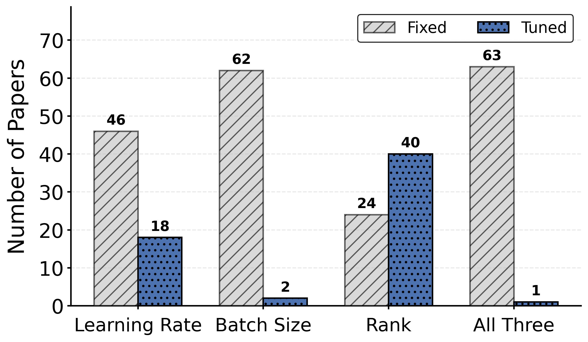
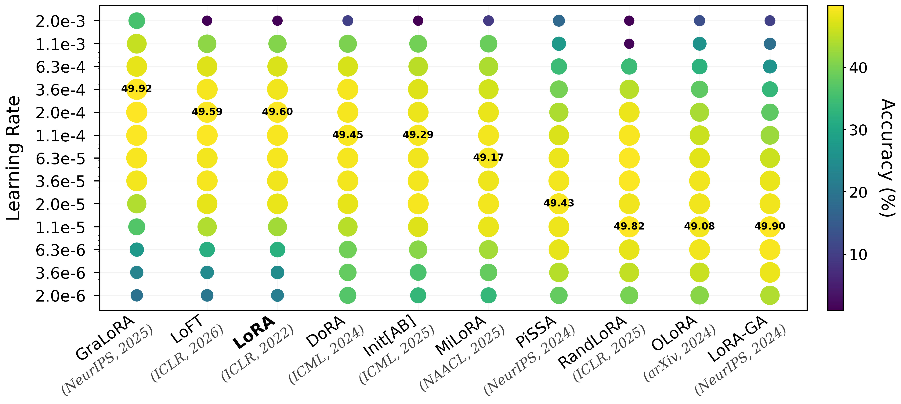
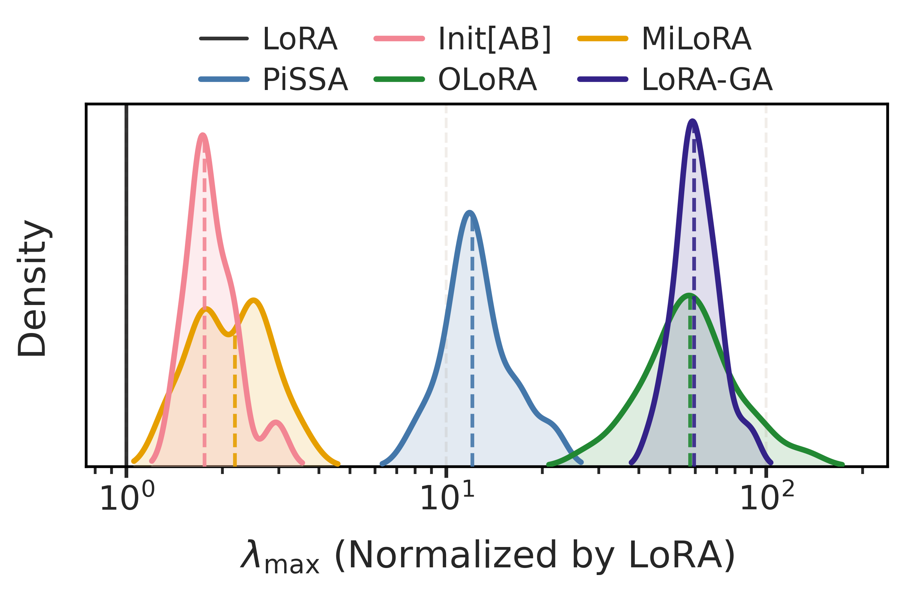

# Learning Rate Matters: Vanilla LoRA May Suffice for LLM Fine-tuning

<div align="left">

[](https://arxiv.org/abs/2602.04998) [](./awesome-lora-paper-list)
</div>

 <!-- [](https://wandb.ai/team_fl/robust_PEFT?nw=nwuserspeeeedlee) -->

## README Table of Contents
- [News](#news)
- [Introduction](#introduction)
  - [1. What is the problem?](#1-what-is-the-problem)
  - [2. Why does it matter?](#2-why-does-it-matter)
  - [3. Which learning rate to use?](#3-which-learning-rate-to-use)
  - [4. How can we tune LoRA methods efficiently?](#4-how-can-we-tune-lora-methods-efficiently)
- [Code Structure](#code-structure)
- [Contact us](#contact-us)
- [Acknowledgements](#acknowledgements)
- [Citation](#citation)

## News
- [2026-05-16] Codebase released!
- [2026-05-15] We updated the second version of our paper on [arXiv](https://arxiv.org/abs/2602.04998)! This version compares five additional LoRA variants and provides practical heuristics for LoRA hyperparameter tuning.
- [2026-02-04] The first version of our paper was released on [arXiv](https://arxiv.org/abs/2602.04998) and [HuggingFace](https://huggingface.co/papers/2602.04998)!

## Introduction

### 1. *What is the problem?*
We conduct a comprehensive audit of advanced LoRA PEFT studies and identify a recurring issue: the majority of works lack thorough hyperparameter tuning, despite this being a standard requirement. In fact, according to the following Figure C1, only 1 out of 64 papers simultaneously considers three hyperparameters, while 46 present results under a fixed learning rate.

<p align="center">
  
</p>
<p align="left">
  <em>
    ▲ Figure C1. Frequency of advanced LoRA-based PEFT studies, categorized by whether learning rate or batch size tuning was applied and whether comparisons with vanilla LoRA across different ranks were conducted. Refer to 
    <a href="./awesome-lora-paper-list"><code>./awesome-lora-paper-list</code></a>
    for the comprehensive list of papers.
  </em>
</p>

### 2. *Why does it matter?*
Without proper hyperparameter tuning, prior conclusions may be ungrounded. Concretely, through extensive experimentation, we demonstrate that while different methods require distinct optimal learning rate ranges, they yield comparable peak performance when configured to their optimal settings. For example, on Qwen3-0.6B, averaged over three runs, the top-performing method (GraLoRA) leads the runner-up (LoRA-GA) by only `0.02%`, and the least effective method (OLoRA) by `0.84%` (as shown in below Figure C2).
  
<p align="center">
  
</p>
<p align="left">
  <em>
    ▲ Figure C2. Performance of Qwen3-0.6B fine-tuned on mathematical reasoning tasks under rank 128 and batch size 64 across learning rates. Different methods reach a similar performance level once the learning rate is properly tuned. Each point is averaged over three training runs. We annotate the peak accuracy of each method and sort methods by their optimal learning rate ranges. Refer to 
    <a href="./run-lora"><code>./run-lora</code></a>
    for code of reproducing our LoRA tuning results.
  </em>
</p>

### 3. *Which learning rate to use?*
By analyzing the eigenvalues of the loss Hessian across various initialization-based LoRA variants, we find that the optimal learning rate is generally negatively correlated with the maximum eigenvalue, aligning with classical learning theories. For example, Figure C3 below shows OLoRA and LoRA-GA exhibit up to $100\times$ higher curvature, explaining the reason behind their requirement for a much lower learning rate ($18.2\times$ lower) in Figure C1. Similarly, PiSSA exhibits $\approx 10\times$ higher curvature, which is consistent with its requirement for a $10\times$ lower learning rate. For Init[AB] and MiLoRA, however, the eigenvalue magnitudes are more similar to those of vanilla LoRA ($\approx 2\times$ higher), supporting their lower optimal learning rates by factors of $1.8\times$ and $3.2\times$ in Figure C1, respectively.

<p align="center">
  
</p>
<p align="left">
  <em>
    ▲ Figure C3. Distributions of the ratios of the top loss Hessian eigenvalues relative to LoRA for Query projection matrices across Transformer layers on Qwen3-0.6B. Dashed lines indicate the medians. Refer to 
    <a href="./run-hessian"><code>./run-hessian</code></a>
    for code of esitimating LoRA Hessian eigenvalues.
  </em>
</p>

### 4. *How can we tune LoRA methods efficiently?*
Since fair comparison requires method-specific tuning but exhaustive searches are computationally expensive,  we identify practical heuristics across learning rate, batch size, LoRA rank, and training duration.  Together with the Hessian eigenvalue analysis, these findings help narrow the hyperparameter search space. Refer to
<a href="./practical-heuristics"><code>./practical-heuristics</code></a> for our summarized practical heursitcs regarding LoRA tuning.

<!-- the [*wand report*](https://wandb.ai/team_fl/robust_PEFT?nw=nwuserspeeeedlee) for our training logs and  -->


## Code Structure

This codebase follows the structure below:

```
lr-matters-lora
├── awesome-lora-paper-list: comprehensive list of LoRA papers
├── run-lora: code for training and evaluating various LoRA methods
├── run-hessian: code for estimating maximum Hessian eigenvalues
└── practical-heuristics: our summarized practical heuristics for LoRA hyperparameter tuning
```

***Please refer to the README files in each folder for more detailed instructions.***

## Contact us

If you encounter any issues (e.g., unclear instructions, bugs, etc.), or if you have any feedback or suggestions, please feel free to contact us:

- Open an [issue](https://github.com/yuang-lee/lr-matters-lora/issues?q=is%3Aissue)
- Open a [discussion](https://github.com/yuang-lee/lr-matters-lora/discussions)
- Email us: `r12946015@ntu.edu.tw`, `cyko@ibm.com`, `pin-yu.chen@ibm.com`, `miyen@iis.sinica.edu.tw`


## Acknowledgements

+ The code in <a href="./run-lora"><code>./run-lora</code></a> is primarily built upon [PiSSA](https://github.com/MuLabPKU/PiSSA) — we thank the authors for providing a well-organized interface for training and evaluating LoRA methods.
+ We also thank the authors of all considered LoRA methods for open-sourcing their work, and all contributors to the official [PEFT](https://github.com/huggingface/peft) package — our work would not have been possible without their detailed documentation, continued maintenance, and prompt handling of issues.
+ When building the code in <a href="./run-hessian"><code>./run-hessian</code></a>, we referred to several well-maintained Hessian codebases, including [PyHessian](https://github.com/amirgholami/PyHessian) and [LLM-Hessian](https://github.com/vectozavr/llm-hessian). We thank the authors for providing the implementation details for Hessian analysis.


## Citation
If you find our paper or codebase useful, please consider citing our work
```
@misc{lee2026learningratemattersvanilla,
      title={Learning Rate Matters: Vanilla LoRA May Suffice for LLM Fine-tuning}, 
      author={Yu-Ang Lee and Ching-Yun Ko and Pin-Yu Chen and Mi-Yen Yeh},
      year={2026},
      eprint={2602.04998},
      archivePrefix={arXiv},
      primaryClass={cs.LG},
      url={https://arxiv.org/abs/2602.04998}, 
}
```