# Practical Heuristics for LoRA Hyperparameter Tuning

Based on extensive hyperparameter tuning experiments, we derive ***five practical heuristics*** for tuning LoRA-based methods, summarized both in Appendix H of the paper and below.

- [I. Prioritize Learning Rate Tuning](#i-prioritize-learning-rate-tuning)
- [II. Mind Batch Size Scaling](#ii-mind-batch-size-scaling)
- [III. Select Learning Rate based on Hessian](#iii-select-learning-rate-based-on-hessian)
- [IV. Increase LoRA Ranks](#iv-increase-lora-ranks)
- [V. Prolong Training Duration](#v-prolong-training-duration)

## ***I. Prioritize Learning Rate Tuning*** 

- Based on the joint optimization of batch size and learning rate across diverse model-task combinations, we suggest that, under limited computational resources, practitioners may prioritize learning rate tuning while fixing the batch size. 
- Importantly, when the batch size is set too large, the best achievable performance under learning rate tuning may start to decay (evident in below Figure P1). 
We therefore suggest using a small or medium batch size as the default choice.

  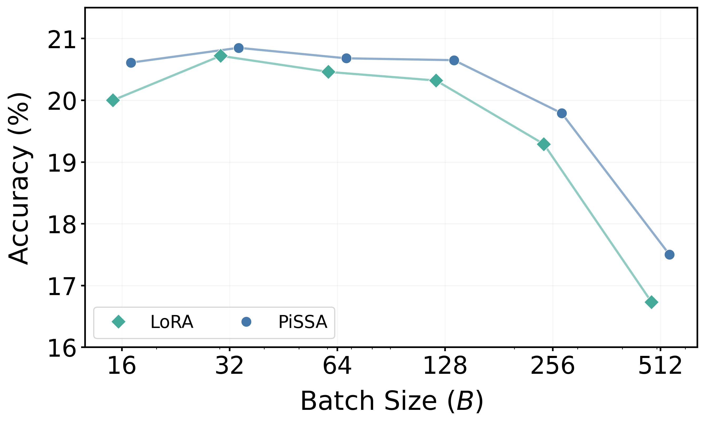

  <em>
    ▲ Figure P1. Best achievable performance of LoRA and PiSSA across different batch sizes on mathematical reasoning tasks with Gemma-3-1B (r=128). While at B > 128, both LoRA and PiSSA can reach approximately 20% accuracy with proper learning rate tuning, the performance upper bound gradually decays when B increases to 512.
  </em>

---

## ***II. Mind Batch Size Scaling*** 

- If additional resources are available and practitioners wish to explore different batch sizes, further performance gains are likely to be marginal once the learning rate has been properly tuned for each batch size. 
- In practice, however, practitioners should still account for the scaling relationship between batch size and learning rate (Table P1), as it provides a useful initial guess for the learning rate when changing the batch size.

  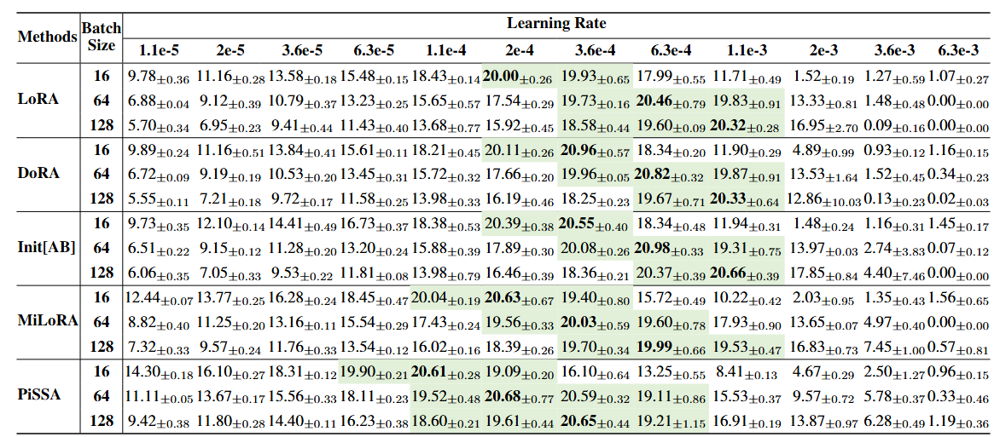

  <em>
    ▲ Table P1. Performance of Gemma-3-1B on mathematical reasoning task across varying batch sizes and learning rates (r=128). Results are reported as mean ± standard deviations over three independent runs. Best results are highlighted in bold, and configurations achieving > 18.5% accuracy (i.e., approximately 90% of the maximum) are shaded in green. 
  </em>

---

## ***III. Select Learning Rate based on Hessian*** 

- As described in our paper, the maximum eigenvalue of the loss Hessian can serve as a useful indicator of a variant's relative operating learning rate range compared with vanilla LoRA. 
- In below Figure P2 and P3, we further show that Hessian trends across different matrix types and Transformer layers are typically consistent, in the sense that they are generally either larger or smaller than those of vanilla LoRA. 

  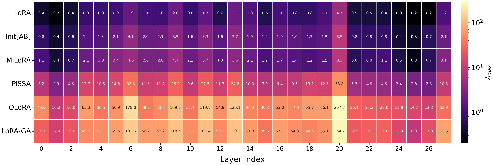

  <em>
    ▲ Figure P2. Heatmap of the top eigenvalues of the Query projection matrix across Transformer layers for Qwen3-0.6B on MetaMathQA (r=128).
  </em>

  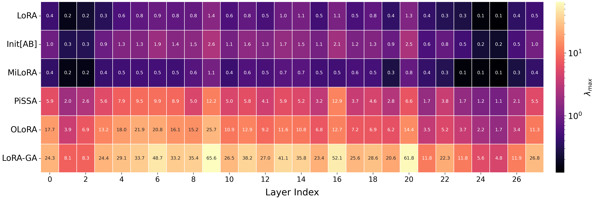

  <em>
    ▲ Figure P3. Heatmap of the top eigenvalues of the Key projection matrix across Transformer layers for Qwen3-0.6B on MetaMathQA (r=128).
  </em>

- Critically, Hessian estimation for LoRA adapters of a single layer requires only around 10 minutes on a single RTX A6000 (try it yourself at <a href="./run-hessian"><code>./run-hessian</code></a>!). 
- Hence, practitioners with sufficient resources may use Hessian analysis to guide initial learning rate tuning ranges before conducting a large scale search.
- We also note that, based on our broad experiments, a given variant typically exhibits a stable relationship in optimal learning rate relative to LoRA across different model-task combinations, in terms of being either higher or lower.
- Practitioners may therefore estimate the Hessian once and leverage the known learning-rate range relationships of specific variants across model-task combinations, without re-running the Lanczos algorithm every time they switch to a new setting.

---

## ***IV. Increase LoRA Ranks*** 

- When sufficient effort has been invested in learning rate tuning at a given rank but the resulting downstream performance remains unsatisfactory, increasing the LoRA rank can be a reliable way to further improve performance, as shown in below Figure P4 and P5 for various methods.

<table align="center">
  <tr>
    <td align="center">
      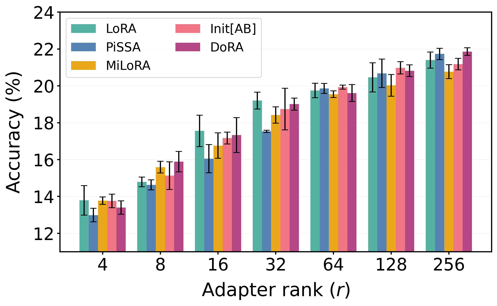 
      <strong>Mathematical reasoning</strong>
    </td>
    <td align="center">
      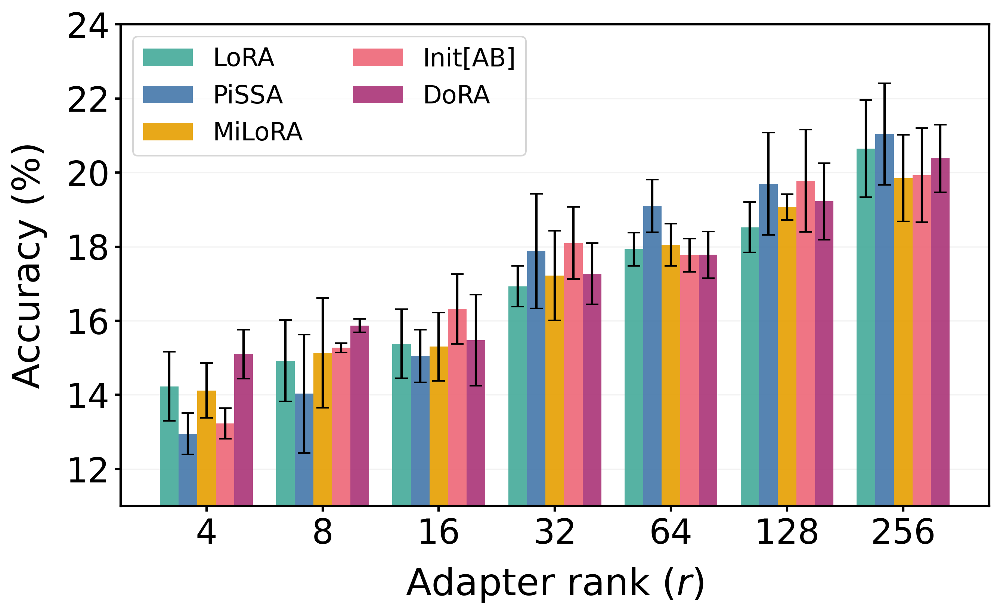 
      <strong>Code generation</strong>
    </td>
  </tr>
</table>

  <em>
    ▲ Figure P4. Best achievable performance of LoRA and its advanced variants across adapter ranks on Gemma-3-1B (B=64).
    With properly tuned learning rates, all methods exhibit similar performance-improvement trends as the rank increases.
    Results are reported as means and standard deviations over three independent runs.
  </em>

<table align="center">
  <tr>
    <td align="center">
       
      <strong>Mathematical reasoning</strong>
    </td>
    <td align="center">
      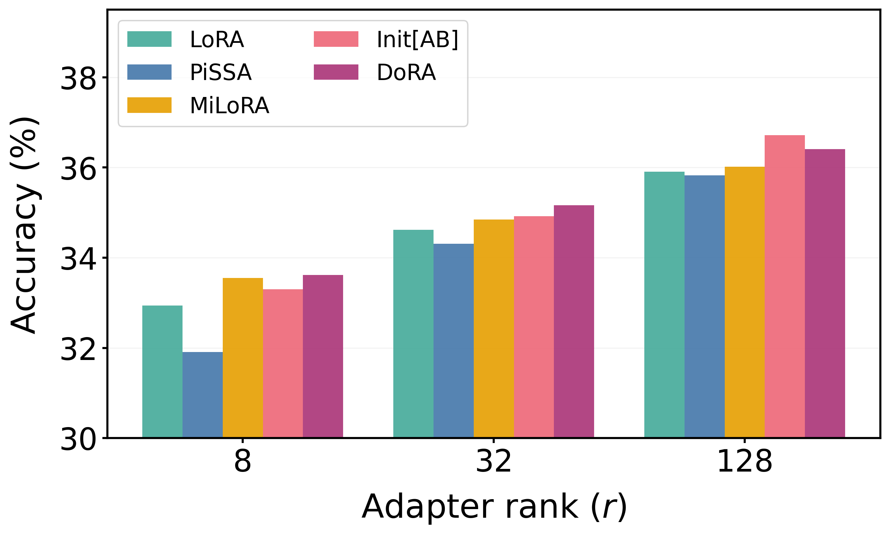 
      <strong>Code generation</strong>
    </td>
  </tr>
</table>

  <em>
    ▲ Figure P5. Best achievable performance of LoRA and its advanced variants across adapter ranks on Llama-2-7B (B={8, 128}).
  </em>

- After switching to a higher rank, however, one should still perform learning rate tuning to elicit the best achievable performance at that rank. Specifically, Figure P6 shows that the optimal learning rate generally decreases as the rank increases, with r=4 requiring a 5.6x larger learning rate than r=256.

  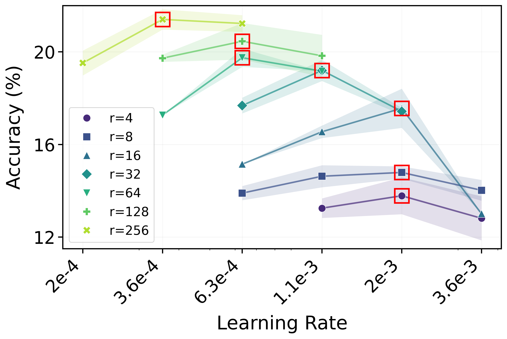

  <em>
    ▲ Figure P6. Vanilla LoRA mathematical reasoning performance across learning rates on Gemma-3-1B with varying ranks (B=64). Red boxes indicate the learning rate yielding the highest accuracy for each configuration.
  </em>

> [!NOTE]
> Although recommending larger ranks for better performance may seem straightforward, we highlight that this trend may not be observed in practice if the learning rate is not properly configured for each rank. In fact, we find that many prior LoRA studies fail to demonstrate such a consistent performance improvement trend as the LoRA rank increases, partly because a fixed learning rate setting was applied.

---

## ***V. Prolong Training Duration*** 

- If practitioners have computational resources to further improve LoRA performance after increasing the LoRA rank with proper learning-rate tuning, we suggest prolonging the training duration as a final step. 
- In particular, one can increase the training duration by using more training samples or training epochs. In both cases, we show in Figure P7 and P8 that, with proper learning rate tuning, various LoRA methods typically have the capacity to further improve their performance. 

  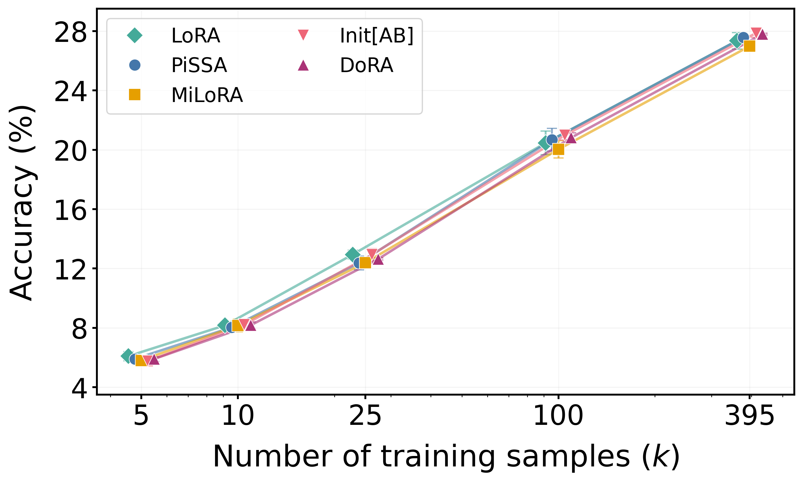

  <em>
    ▲ Figure P7. Best achievable performance of LoRA and its variants across different training sample sizes on mathematical reasoning with Gemma-3-1B (r=128, B=64).
  </em>

  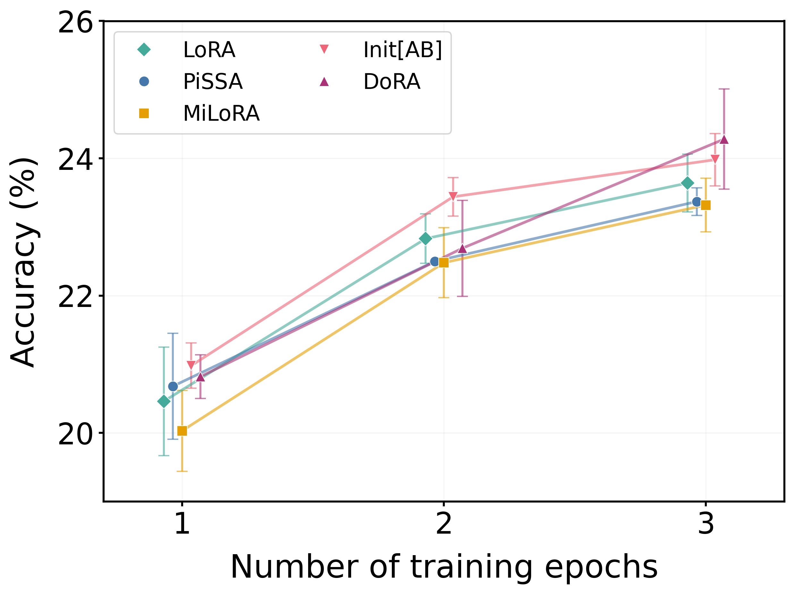

  <em>
    ▲ Figure P8. Best achievable performance of LoRA and its variants across different number of training epochs on mathematical reasoning with Gemma-3-1B (r=128, B=64).
  </em>

- Interestingly, we observe that the optimal learning-rate range shifts slightly downward as the amount of training increases, consistent with the tendency described in ***practical heuristic IV***. However, the magnitude of this decay is relatively modest, as shown in Figure P9: the optimal learning rates for N=5k and N=395k differ by only 3.1x.

  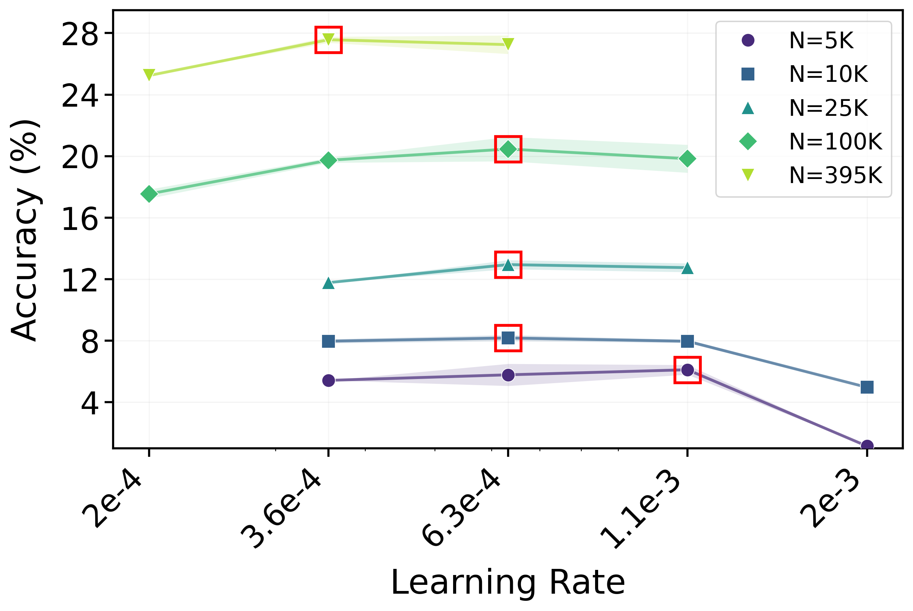

  <em>
    ▲ Figure P9. Vanilla LoRA mathematical reasoning performance across learning rates on Gemma-3-1B with varying number of training samples (r=128, B=64). Red boxes indicate the learning rate yielding the highest accuracy for each configuration.
  </em>

